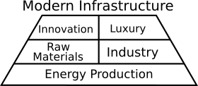

# Retaining a Modern Infrastructure

## Modern Technology

In the past things were built manually one at a time on a case by case basis. This often, not always, resulted in high quality products that lasted a very long time (often multiple generations), but was slow allowing only a small amount of products to be made, and each product was expensive. When something broke, you got it fixed, because it was cheaper and worth it over buying new. 

The industrial revolution brought about mass production via specialized machines which in turn made it viable to create many products at a lower quality, where a user could discard the product and pick up a new one cheaply. So our economy today has a large focus on moving products quickly into and back out of people's hands. People buy products and, depending on the product, either use them once then throw away or replace them every one to five years. Part of this is due to rapid development, I.e. a phone from this year has slightly better features over one from last year. It also has a lot to do with convenience, for example wiping up a spill with a paper towel and tossing it is easier then with a cloth and needing to wash it later. 

So a lot of our technology is optimized around mass-production and producing disposable objects. This has benefits and draw backs. Products are cheap and people can easily acquire whatever they want, but things are lower quality and need regular replacing. These are not desirable traits for people making their own stuff. We do not need a lot of items, and we would prefer that our items last. However at the same time, we would rather not go back to time, skill, and labor intensive processes to produce our items. It would be better to bring the old mentality and apply new tools to it.

For us to merge the two, we need to sketch out how things are done now, and how we need to change them with the old mentality in mind to get our new methodology.

## Simplified Modern Infrastructure

I'm going to break Modern Infrastructure, the set of tools which provide for our wants and needs, into 3 layers with 5 parts and arrange them into a pyramid shaped diagram like the below image.

* At the pyramid's base is usable energy and the technologies that produce it. Without energy society does not have the ability or time for advanced infrastructure.
* Built on top of energy is the ability to both acquire raw materials and use them to make useful items.
* All of that lays down the supports for innovation and luxury positioned at the top.

A self-sufficient community should follow this infrastructure but scale it to the community's size. Power sources should be producible and repairable by the community, processes for producing things should match the scale that the community needs, and producing raw materials should be done in a way the community can support without undue strain on it's people.

## Energy Production

Energy production and manipulation is essential to self-sustainability. Without a source of energy, providing for the most basic needs becomes life dominating; without multiple sources of energy, our self-sufficiency will be fragile. Energy harnessed into usable forms is what allows for technology to force multiply people’s work. And technology without the energy to power it is nigh worthless.

We need to keep in mind our capabilities and the natural resources at our disposal. Depending on the geography, latitude, wind speeds, and such. If you have flowing water, then hydro-electric is a really good idea. If you have good wind speeds, a windmill might be the way to go. Solar is readily available most place, though is not consistent which means you need more robust storage.

We should also remember to consider technologies that are often overlooked by society at large due to it not fitting into the modern paradigm of mass-production. Methane Digesters are a decent example, they produce a gas mix similar to natural gas and decent fertilizer from animal manure and organic matter. So if you raise animals you could take waste hay and menure and produce a burnable gas while getting good fertaliser a lot faster then composing can do.

Finally, it will also be important to look for technologies that can make a previously useless resource, usable. For example there has been work to try and build a generator that works on low wind speeds, one example can be seen in a project from 2012 called the [Wind Harvester](http://www.gizmag.com/wind-harvester-reciprocating-motion-wind-turbine/21565/) which can supposedly work both close to the ground and with low wind speeds.

Once we build a solid base of energy generation, we can move onto providing for our needs.

## Raw Materials and Industry

The next level up deals with acquiring raw materials and processing them into usable things. This includes providing for all of our basic needs and the tools to do so. 

### Raw Materials

Growing plants and raising animals are both readily available ways to create new raw materials. There is obviously the food aspect and direct materials like cotton that can become cloth, but also the many side products we could use. Side products like manure that has a few uses, especially as fertilizer, and inedible plant matter that can either help feed animals or be processed to provide useful chemicals. We should maintain a mentality of using every scrap of the things we produce as efficiently as possible. 

To make the most of this, it's important to pick the right animals and plants. It **might** not be best for some small groups to try and raise cattle as their main source of meat, and instead focus on a mix of smaller animals like rabbits, chickens, and goats as some examples. Focusing on a variety of plants that can grow close together and complement each other is better then trying to grow a mono crop, and you can extract a greater variety of resources from them as well. We need to move away from mass production farming and build ecosystems that complement each other and result in a number of usable products.

Other raw materials are also important. Metals are probably the hardest raw materials for a small scale community to make. We need to go back once again and re-examin technologies that society at large have ignored. For example, Red Clay ([Ultisol](https://en.wikipedia.org/wiki/Ultisol)) that is prevalent in the southeast of the USA is chock full of iron, aluminum, and various minerals. There are ways to extract aluminum from clay that may work for Red Clay via a closed loop sulfuric acid system. Similarly there is a bacteria colloquially called Iron Bacteria that is a nuance to many people making their well water taste bad, but was successful used by Primitive Technology, a YouTube channel dedicated to building primitive tools, to extract iron and make a simple knife. These and other things like them may be good ways to produce a little bit of metal for use in the community.

Finally, we might consider focusing on salvage. Rebuilding other people's trash into usable tools. While often not a profitable thing to do, it is a way to acquire materials for free or at least very cheaply.

### Industry

With raw materials covered, we are now on the processing side of things. Like with everything else it is good to keep in mind that many industrial production methods in the modern industry sector are focused on mass production, and are not really suitable for a community like we are trying to build. Modern production focused machines are often hyper specific automated systems, like a chain maker. It makes a chain and only a chain and often only a small range of gauges at that. They can mass produce the item with no real skill needed, but can only make the one item and has no flexibility. 

We also should try to reduce the need for high skill, manual processes. We don't want to rely purely on hand tools, and many other tools like lathes need a certain skill to use. It is good to have both hand tools and manual electric tools and train people with them, but it is probably best to design the production of our core needs around automated tools as much as possible. Automated tools like 3D Printers, CNC mills, and the like. 

These computer controlled systems are a nice balance of automation and flexibility. You still need design skills to use these tools, but the fabrication process is quite a bit lower skill. Plus the design is only needed to be developed once, then you just input materials and they fabricate the design repeatedly. And they are quite flexible also good at making a wide range of items instead of a single thing. Hand and manual electric tools are still more flexible, but the automation is worth while trade off.

## Innovation and Luxury

Once Energy, Raw Materials, and Processing of those materials are all sorted out, you can figure out how much free time is left over week to week. This free time is a great resource in and of itself allowing us to pursue Innovation of our tools and Luxury items.

Innovation is obviously important as we should always be working on improving our tools. People can either focus on specifically improving tools that are being used, or experiment with ideas that may or may not turn into a new, better technology. It is also good to note that a large part of this is collaboration, both with other like-minded communities that are trying to pursue better self-sufficiency tools, and with the greater global community on more general open source software and hardware.

Luxury is also important. When we talk about Luxury we mean a mix of **leisure time** and the production of **non-essential goods**. Leisure time is important to reduce stress and recharge. It helps keep people fresh, improves the groups cohesion both through bonding via play and reducing the chance a person will needlessly snap at others, and is overall important to one's mental health. Luxury items are nice things to have that while not critical for day to day survival, are still very useful. Spending time creating art, building toys, and otherwise creating various forms of entertainment. 

